---

# Documentation Technique Complète – Système Multi-Tenant & Pipelines

## Introduction
Ce document décrit l’ensemble des fonctionnalités du moteur d’importation et d’analyse financière multi-tenant.  
Chaque section présente une **feature** avec ses sous‑fonctions illustrées par des diagrammes Mermaid.

---

## Feature A — Organisation (Tenants)
**Description** : Création et gestion des tenants (isolation par base de données ou schéma).

### Sous‑features

#### 1. Création d’un tenant par l’administrateur moteur
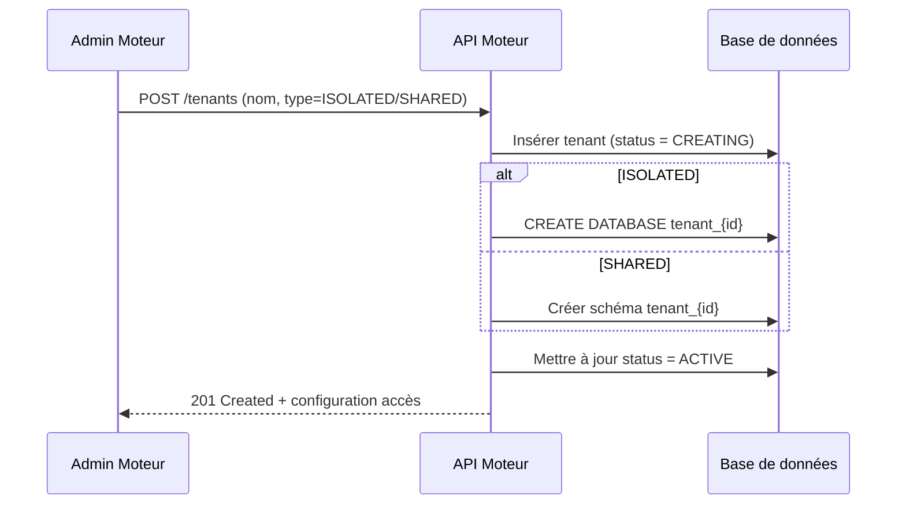

#### 2. Suppression d’un tenant (avec CASCADE et DROP DB si ISOLATED)
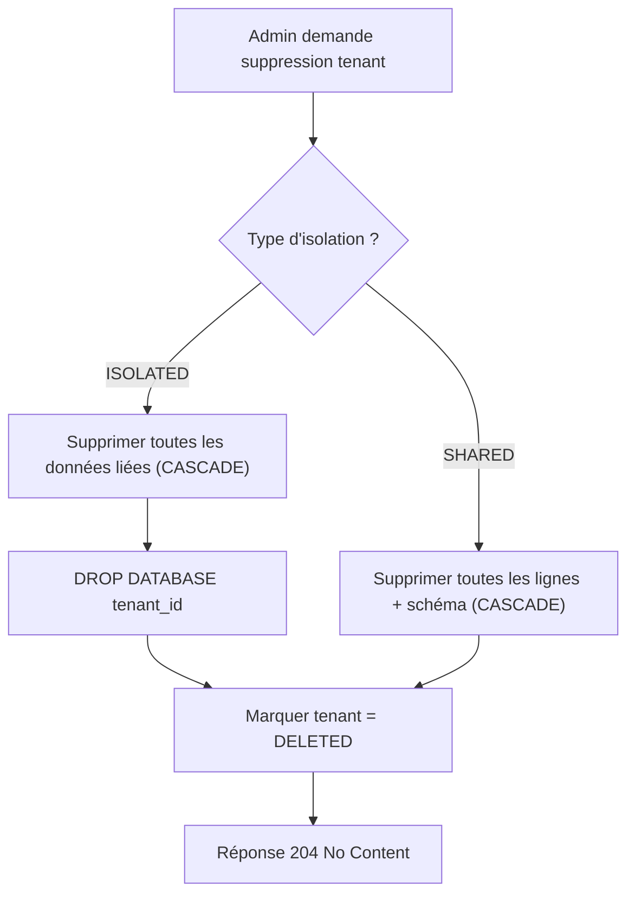

---

## Feature B — Connecteurs ERP
**Description** : Déclaration des ERP disponibles (type, clé publique PEM pour vérification JWT).

### Sous‑features

#### 1. Création d’un connecteur (avec clé publique PEM)
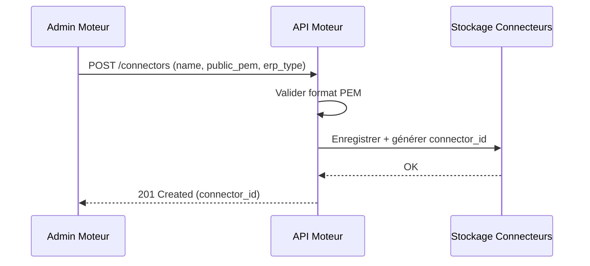

#### 2. Suppression d’un connecteur (refusé si utilisé)
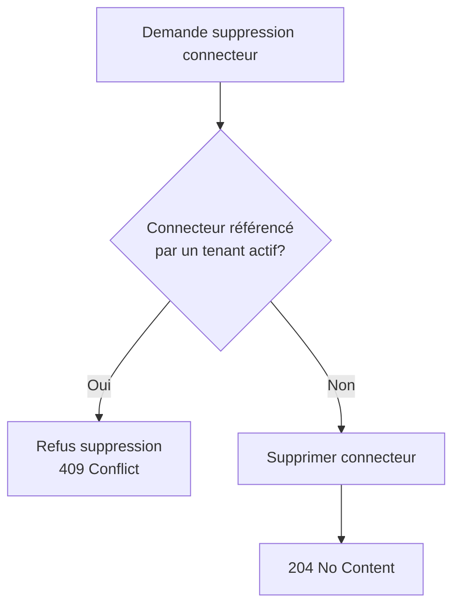

#### 3. Exemple complet : création d’un connecteur et connexion ERP

Cela permet d’illustrer concrètement :

- La création du connecteur par l’admin (déjà décrite en 1.)
- Les informations partagées avec l’équipe ERP
- La vérification JWT lors de la connexion (qui complète le flux de la Feature D)

Voici comment l’intégrer dans la structure actuelle :

### Sous‑features

#### 1. Création d’un connecteur (avec clé publique PEM)
[... diagramme existant ...]

#### 2. Suppression d’un connecteur (refusé si utilisé)
[... diagramme existant ...]

#### 3. Exemple complet : création d’un connecteur et connexion ERP
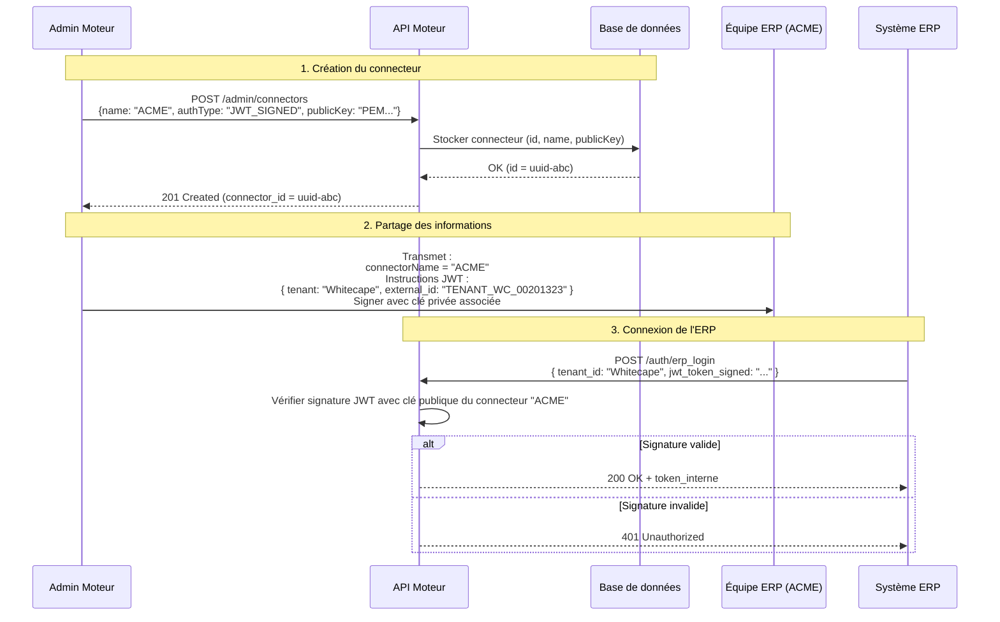

---

## Feature C — Pipelines d’Importation
**Description** : Importation et traitement des données ERP (factures, écritures comptables).

### 1. Cycle de vie complet d’un pipeline
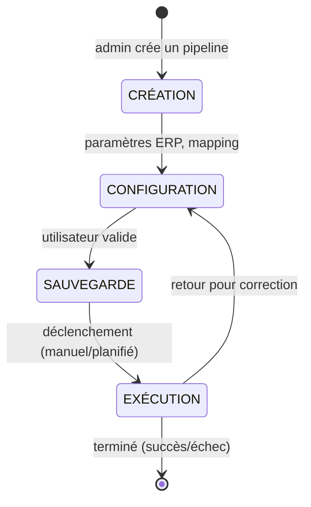

### 2. Flux d’exécution interne
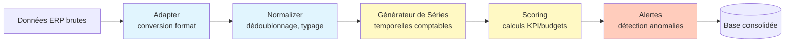

### 3. Gestion des statuts comptables (Provisionnel → Définitif)
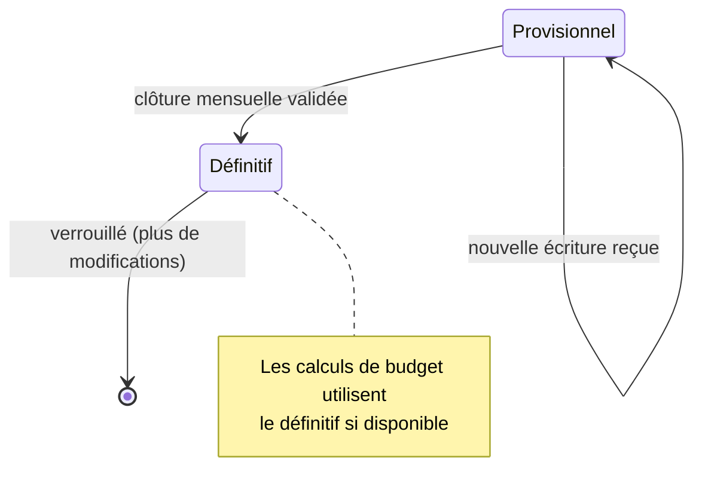

### 4. Détection des documents manquants
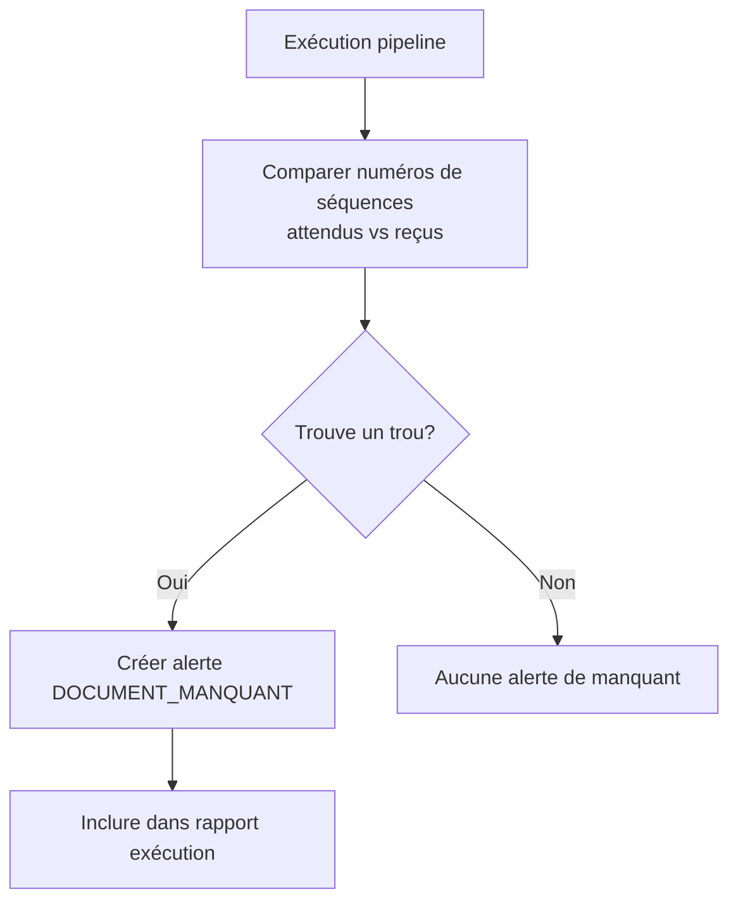

---

## Feature D — Connexion Tenant ↔ ERP
**Description** : Authentification déléguée par jeton JWT (l’ERP signe, le moteur vérifie).

### Flux complet JWT
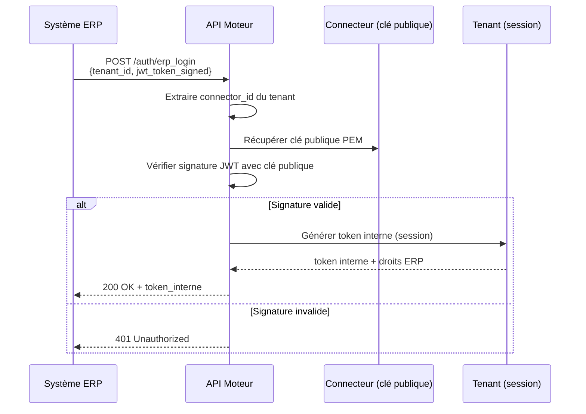

### Isolation des données en session ERP
- Le token interne ne permet d’accéder qu’aux ressources du **tenant** et du **connecteur ERP** utilisé.
- Chaque requête est filtrée automatiquement par `tenant_id` et `erp_session_id`.

---

## Feature E — Alertes et Feedback
**Description** : Gestion des anomalies détectées (factures dupliquées, montants incohérents, documents manquants).

### Machine à états des alertes
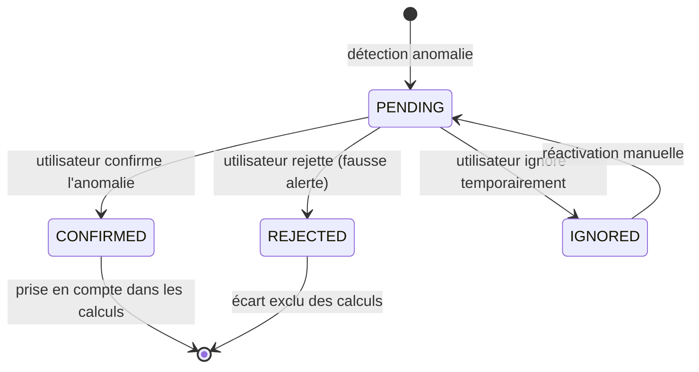

### Impact sur les calculs (exclusion/inclusion des factures)
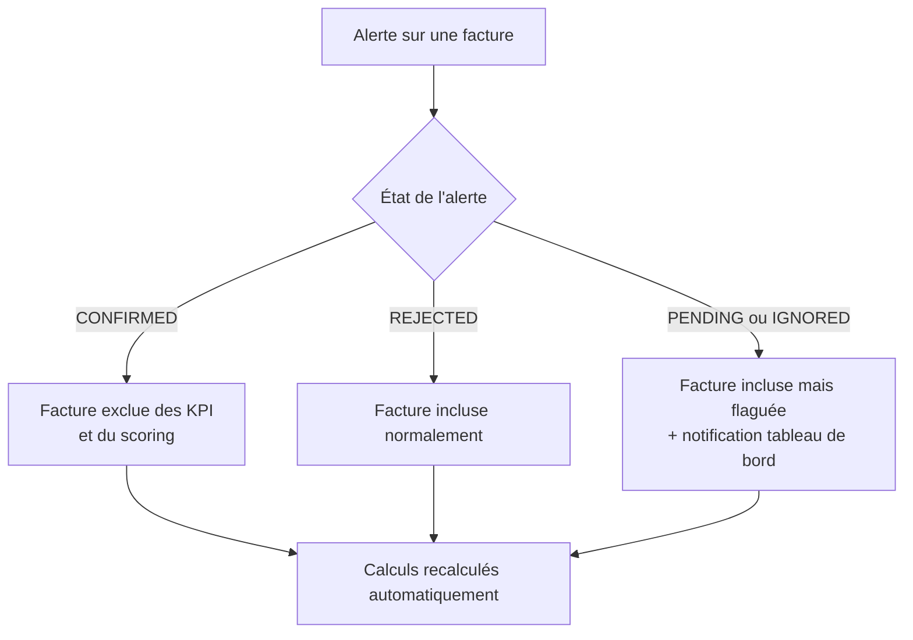

---

## Feature F — Budget et Prévisions
**Description** : Calculs budgétaires sans persistance (les budgets sont recalculés à la demande).

### Philosophie (aucune persistance)
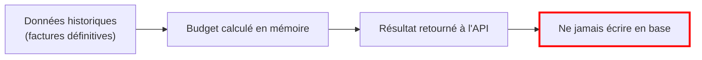

### Flux budgétaire complet
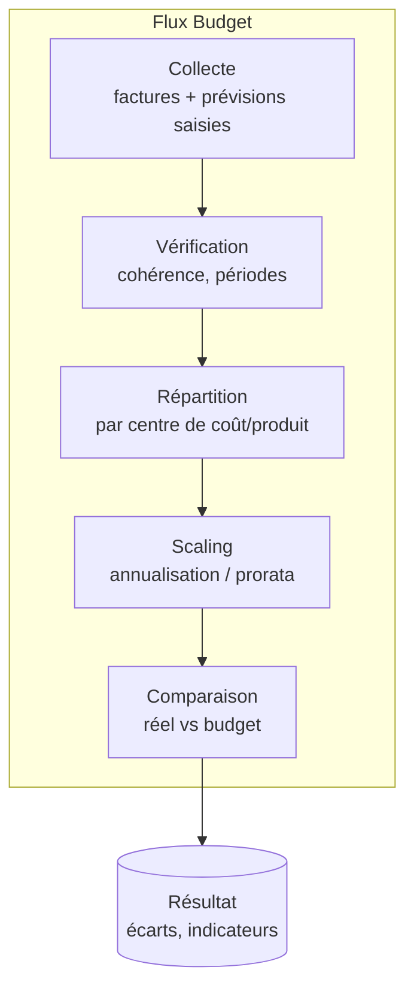

### Endpoints budgétaires (exemples)
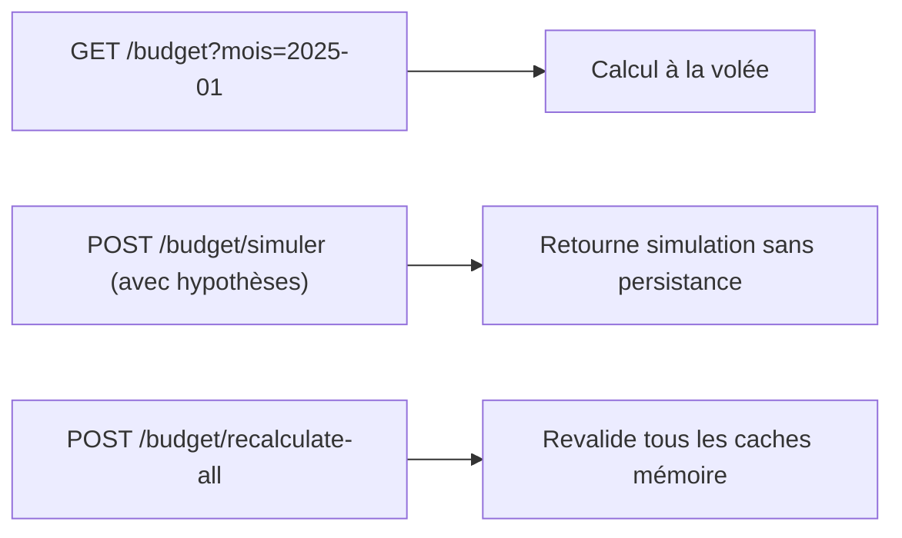

---

## Feature G — Supervision et Administration
**Description** : Tableaux de bord administrateur avec indicateurs globaux.

### Indicateurs globaux et filtres par tenant
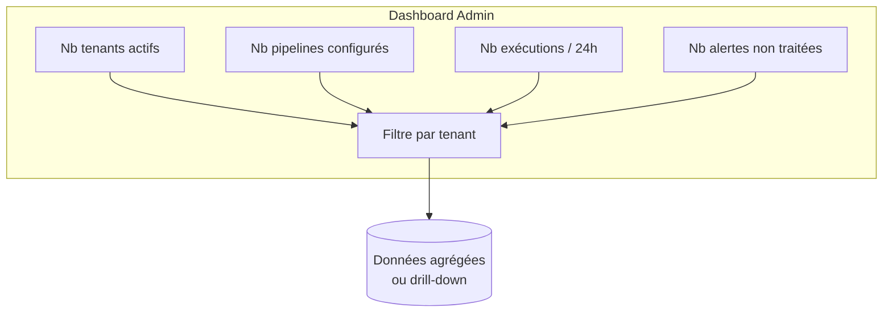

### Exemple d’affichage
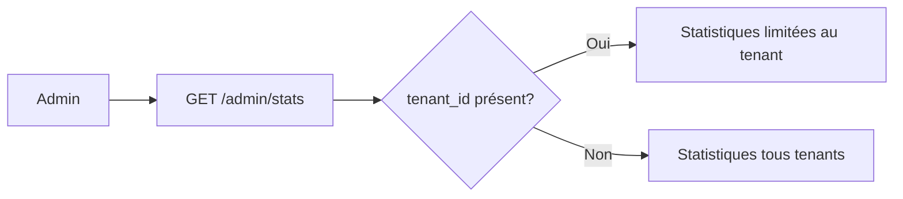

---

## Sécurité — Isolation Multi‑Tenant

### Architecture de sécurité
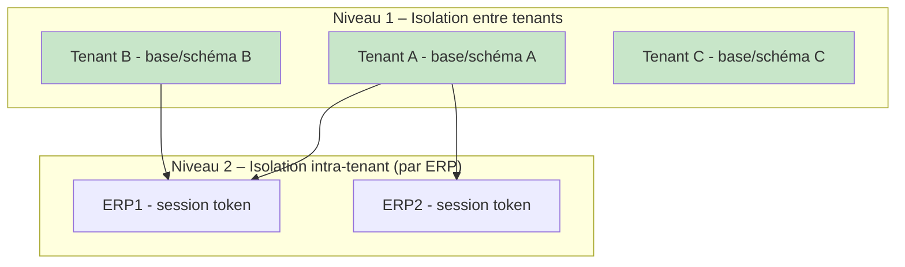

### Mesures de sécurité clés
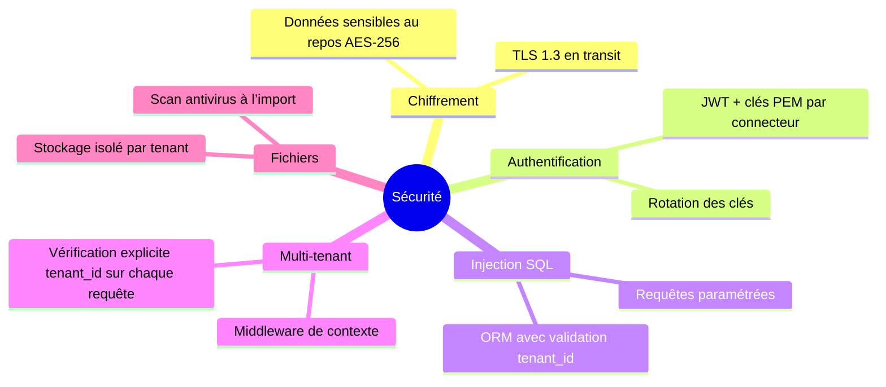

---

## Codes d’Erreur — Gestion des exceptions
Réponses API standardisées avec code HTTP explicite.

| Code HTTP | Signification         | Exemple de cas                             |
| --------- | --------------------- | ------------------------------------------ |
| 400       | Requête invalide      | Payload JSON mal formé, paramètre manquant |
| 401       | Non authentifié       | JWT expiré ou signature invalide           |
| 403       | Non autorisé          | Tentative d’accès à un autre tenant        |
| 404       | Ressource introuvable | Pipeline ID inexistant                     |
| 409       | Conflit               | Suppression d’un connecteur encore utilisé |
| 500       | Erreur interne        | Échec inattendu de la base de données      |

### Gestion des erreurs (flow)
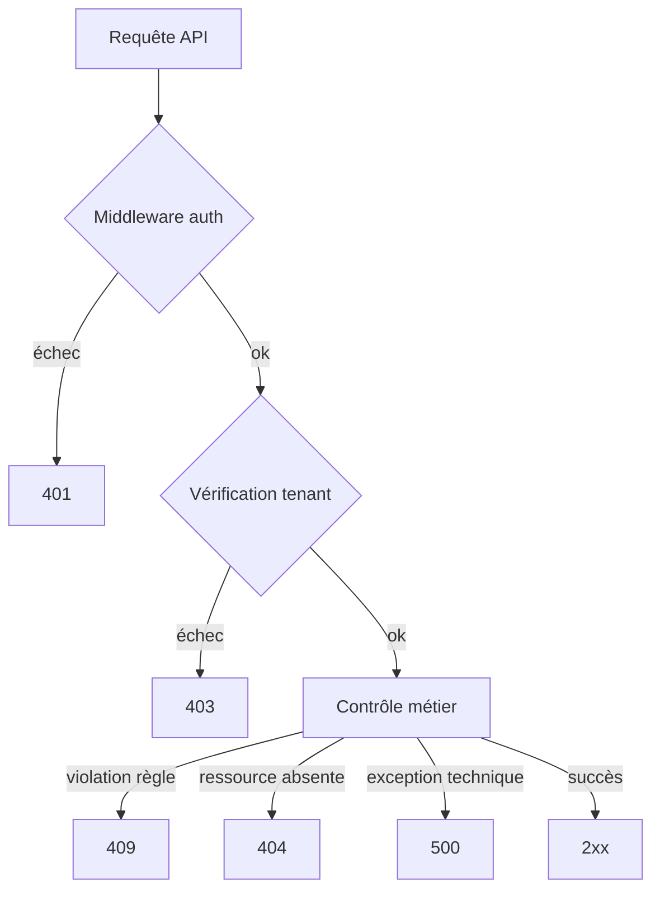

---

