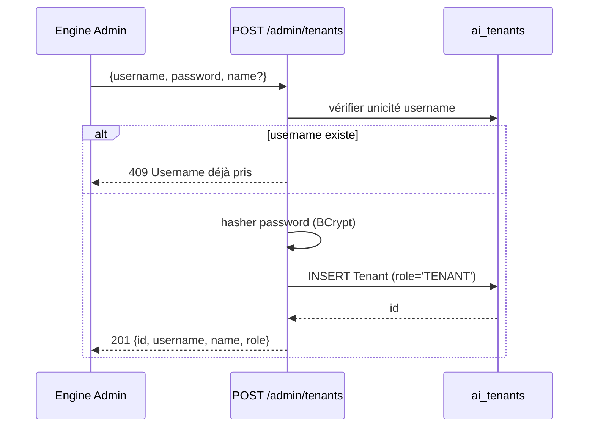
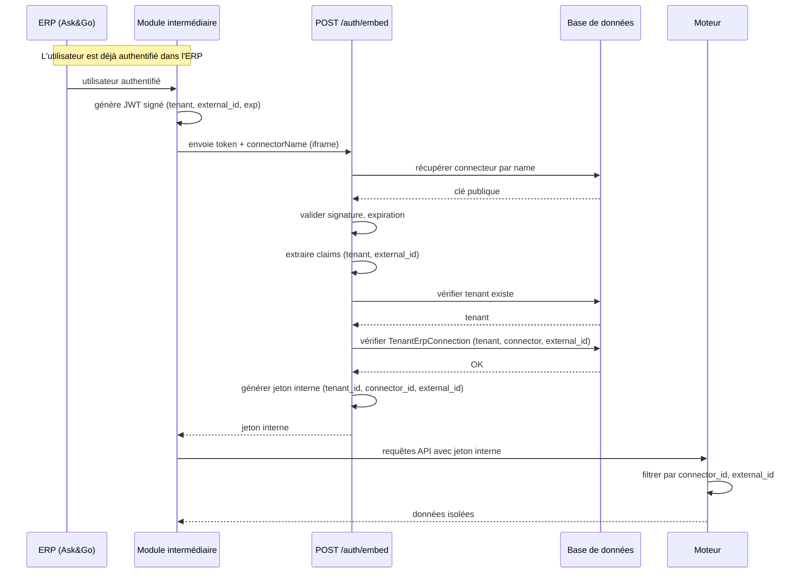
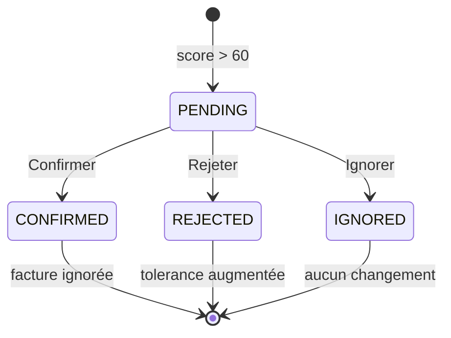
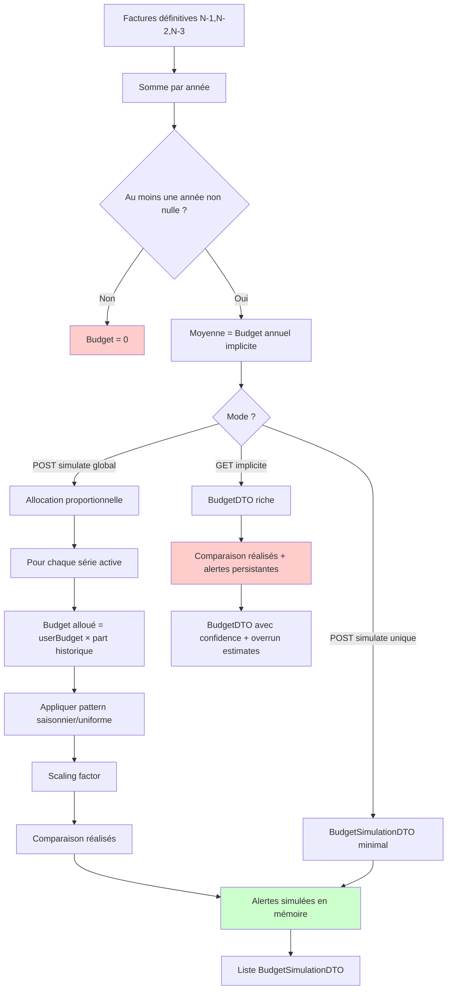

# Documentation Technique & Fonctionnelle Complète – Moteur de Détection d'Anomalies et Prévisions Budgétaires

**Version 3.0 – Document unique de référence (équipes techniques, testeurs, clients, intégrateurs ERP)**

---

## Table des matières

1. [Vue d’ensemble du système](#1-vue-densemble-du-système)
2. [Architecture technique détaillée](#2-architecture-technique-détaillée)
3. [Modèle de données – schéma physique](#3-modèle-de-données--schéma-physique)
4. [Authentification et gestion des rôles](#4-authentification-et-gestion-des-rôles)
5. [Feature A – Organisation (tenants)](#5-feature-a--organisation-tenants)
6. [Feature B – Connecteurs ERP](#6-feature-b--connecteurs-erp)
7. [Feature C – Pipelines d’importation](#7-feature-c--pipelines-dimportation)
   - 7.1 Création et configuration d’un pipeline
   - 7.2 Jointures SQL et extraction sécurisée
   - 7.3 Normalisation et validation des données
   - 7.4 Gestion des statuts : flux `REÇU` → `COMPTABILISÉ`
   - 7.5 Saisonnalité automatique (Python)
   - 7.6 Scoring et création d’alertes
   - 7.7 Détection des documents manquants
   - 7.8 Planification et rapports d’exécution
8. [Feature D – Connexion tenant ↔ ERP (authentification déléguée par jeton)](#8-feature-d--connexion-tenant--erp-authentification-déléguée-par-jeton)
9. [Feature E – Alertes et feedback](#9-feature-e--alertes-et-feedback)
10. [Feature F – Budget et prévisions](#10-feature-f--budget-et-prévisions)
11. [Feature G – Supervision et administration](#11-feature-g--supervision-et-administration)
12. [Sécurité et isolation des données](#12-sécurité-et-isolation-des-données)
13. [Exemples complets de flux API](#13-exemples-complets-de-flux-api)
14. [Codes d’erreur et gestion des exceptions](#14-codes-derreur-et-gestion-des-exceptions)
15. [Annexes – tableaux récapitulatifs](#15-annexes--tableaux-récapitulatifs)

---

## 1. Vue d’ensemble du système

**Pour les non‑techniciens**  
Le moteur est une application qui se connecte aux systèmes de gestion d’entreprise (ERP) pour importer automatiquement les factures, bons de commande ou bons d’achat. Il analyse ensuite ces documents pour détecter des anomalies (montants suspects, doublons, factures manquantes) et aide à piloter le budget (budget implicite basé sur l’historique, simulations, prévisions sur 24 mois). L’accès peut se faire soit par un login classique (administrateur du moteur ou de l’organisation), soit par une intégration directe dans l’ERP via une iframe, sans mot de passe supplémentaire.

**Pour les techniciens**  
L’application est un backend Java Spring Boot exposant une API REST JSON. Elle utilise PostgreSQL comme base de données, Spring Security pour l’authentification JWT, et des scripts Python pour le calcul statistique (scoring, saisonnalité). L’intégration avec les ERP se fait via des pipelines configurables (JDBC, CSV, API). L’isolation des données est stricte entre les organisations (tenants) et même entre les différents connecteurs ERP d’une même organisation.

---

## 2. Architecture technique détaillée

### 2.1 Stack technique

| Couche | Technologie | Version | Rôle |
|--------|-------------|---------|------|
| Langage | Java | 17+ | Logique métier |
| Framework | Spring Boot | 3.x | Conteneur, injection de dépendances |
| Sécurité | Spring Security | 6.x | Authentification, autorisation |
| Persistance | Spring Data JPA | 3.x | Accès base de données |
| Base de données | PostgreSQL | 14+ | Stockage principal |
| Migrations | Flyway | 9.x | Gestion du schéma |
| Chiffrement | JCA (AES-GCM) | — | Chiffrement des mots de passe DB |
| JWT | Nimbus JOSE + JWT | 9.x | Jetons internes |
| Python | CPython | 3.9+ | Scripts de scoring et de série |
| Build | Maven | 3.9+ | Compilation |

### 2.2 Diagramme d’architecture

```mermaid
flowchart TB
    subgraph Clients
        A[Engine Admin UI]
        B[Tenant UI]
        C[ERP (module intermédiaire)]
    end

    subgraph Moteur
        API[API REST / Controllers]
        Auth[Authentification / Token Relay]
        Pipeline[Pipeline Executor]
        Python[Python scoring]
        DB[(PostgreSQL)]
    end

    subgraph Sources
        JDBC[Base de données ERP]
        CSV[Fichier CSV]
        REST[API externe]
    end

    A --> API
    B --> API
    C --> Auth
    Auth --> API
    API --> Pipeline
    Pipeline --> Python
    Python --> DB
    Pipeline --> DB
    API --> DB
    Pipeline --> JDBC
    Pipeline --> CSV
    Pipeline --> REST
```

### 2.3 Composants clés – rôles résumés

| Composant | Rôle |
|-----------|------|
| **Engine Admin** | Administrateur du moteur (création des tenants, connecteurs, supervision) |
| **Tenant** | Organisation cliente ; son administrateur gère pipelines, alertes, budget |
| **Utilisateur ERP** | Personne accédant via l’intégration iframe (aucun compte stocké) |
| **Pipeline** | Configuration d’import (JDBC, CSV, API) |
| **Série** | Regroupement de factures par fournisseur + libellé + champs supplémentaires |
| **Scoring Python** | Scripts `detect.py` (anomalies) et `compute_series.py` (saisonnalité) |

---

## 3. Modèle de données – schéma physique

*(Pour les développeurs)*  
Les tables principales sont décrites ci‑dessous. Les clés étrangères utilisent `ON DELETE CASCADE` pour garantir l’intégrité référentielle lors de la suppression d’un tenant.

### 3.1 Table `ai_tenants`

| Colonne | Type | Contrainte | Description |
|---------|------|------------|-------------|
| `id` | UUID | PK | Identifiant unique du tenant |
| `username` | VARCHAR(100) | UNIQUE, NOT NULL | Nom d’utilisateur pour l’authentification |
| `password_hash` | VARCHAR(255) | — | Hash BCrypt du mot de passe |
| `role` | VARCHAR(20) | NOT NULL | `ADMIN` ou `TENANT` |
| `name` | VARCHAR(255) | — | Nom d’affichage (optionnel) |
| `db_mode` | VARCHAR(20) | NOT NULL | `SHARED` ou `ISOLATED` |
| `db_url`, `db_username`, `db_password` | TEXT | — | Connexion base dédiée (chiffrée) |
| `created_at` | TIMESTAMP | NOT NULL | Date de création |

### 3.2 Table `ai_erp_connectors`

| Colonne | Type | Description |
|---------|------|-------------|
| `id` | UUID | PK |
| `name` | VARCHAR(100) | UNIQUE, nom du connecteur (ex: `Ask&Go`) |
| `auth_type` | VARCHAR(50) | `JWT_SIGNED` (pour l’instant) |
| `public_key` | TEXT | Clé publique PEM pour validation des jetons |
| `created_at` | TIMESTAMP | Date de création |

### 3.3 Table `ai_tenant_erp_connections`

| Colonne | Type | Contrainte | Description |
|---------|------|------------|-------------|
| `id` | UUID | PK | |
| `tenant_id` | UUID | FK → `ai_tenants(id)` ON DELETE CASCADE | |
| `connector_id` | UUID | FK → `ai_erp_connectors(id)` ON DELETE RESTRICT | |
| `external_id` | TEXT | NOT NULL, UNIQUE (connector_id, external_id) | Identifiant externe (ex: `whitecape_ask`) |
| `created_at` | TIMESTAMP | NOT NULL | |

### 3.4 Table `ai_pipelines`

| Colonne | Type | Description |
|---------|------|-------------|
| `id` | UUID | PK |
| `tenant_id` | UUID | FK → `ai_tenants(id)` ON DELETE CASCADE |
| `name` | VARCHAR(255) | Nom du pipeline |
| `source_type` | VARCHAR(20) | `JDBC`, `CSV`, `API` |
| `status` | VARCHAR(20) | `DRAFT`, `ACTIVE`, `PAUSED` |
| `config_json` | JSONB | Configuration complète (mapping, jointures, statuts, conditions, planification) |
| `connector_id` | UUID | FK → `ai_erp_connectors(id)` (optionnel) |
| `external_id` | TEXT | (optionnel) Hérité de la liaison tenant‑ERP |
| `active` | BOOLEAN | Par défaut `true` |
| `created_at`, `updated_at` | TIMESTAMP | |

### 3.5 Table `ai_invoices`

| Colonne | Type | Description |
|---------|------|-------------|
| `id` | UUID | PK |
| `tenant_id` | UUID | → tenant |
| `pipeline_id` | UUID | → pipeline |
| `connector_id` | UUID | → connecteur (pour filtrage ERP) |
| `external_id` | TEXT | Identifiant externe |
| `series_id` | UUID | FK → `ai_series(id)` |
| `supplier` | VARCHAR(255) | Fournisseur normalisé |
| `label` | VARCHAR(255) | Libellé (optionnel) |
| `amount` | NUMERIC(15,2) | Montant |
| `invoice_date` | DATE | Date de la facture |
| `is_final` | BOOLEAN | `false` = provisionnel, `true` = définitif |
| `accounting_status` | VARCHAR(50) | `RECEIVED` ou `VALIDATED` |
| `received_date` | TIMESTAMP | Date d’import du provisionnel |
| `validation_date` | TIMESTAMP | Date de passage en définitif |
| `status` | VARCHAR(20) | `ACTIVE`, `ANOMALY`, `TREATED`, etc. |
| `source` | VARCHAR(50) | Provenance (`WORKFLOW_IMPORT`, `ACCOUNTING_POSTING`) |
| `ignored` | BOOLEAN | `true` si exclue des calculs |
| `extra_data` | JSONB | Champs supplémentaires |

### 3.6 Table `ai_series`

| Colonne | Type | Description |
|---------|------|-------------|
| `id` | UUID | PK |
| `tenant_id` | UUID | → tenant |
| `pipeline_id` | UUID | → pipeline |
| `connector_id` | UUID | → connecteur (filtrage ERP) |
| `external_id` | TEXT | (optionnel) |
| `supplier` | VARCHAR(255) | Fournisseur |
| `label` | VARCHAR(255) | Libellé |
| `group_cols` | JSONB | Colonnes de regroupement (ex: `["supplier","label"]`) |
| `group_key_extras` | JSONB | Valeurs des champs supplémentaires |
| `n` | INTEGER | Nombre de factures définitives |
| `mu` | NUMERIC(15,2) | Moyenne générale |
| `sigma` | NUMERIC(15,2) | Écart type |
| `cv` | NUMERIC(10,4) | Coefficient de variation |
| `median_gap_days` | INTEGER | Écart médian en jours entre dates |
| `last_date` | DATE | Dernière date (tous statuts) |
| `last_received_date` | DATE | Dernière date provisionnelle |
| `last_validated_date` | DATE | Dernière date définitive |
| `monthly_mu` | JSONB | Map mois → moyenne historique (0 si vide) |
| `use_seasonality` | BOOLEAN | Détecté automatiquement par Python |
| `tolerance_pct` | NUMERIC(5,2) | Tolérance en pourcentage (défaut 10) |
| `tolerance_days` | INTEGER | Tolérance en jours (défaut 10) |
| `forecast_start_today` | BOOLEAN | Si `true`, les prévisions commencent aujourd’hui |
| `active` | BOOLEAN | Série active |

### 3.7 Autres tables

- `ai_anomalies` : stocke les scores calculés par Python (une par facture et par série).
- `ai_alerts` : alertes créées lorsqu’un score > 60.
- `ai_feedback` : décisions des utilisateurs sur les alertes (confirmer/rejeter/ignorer) avec anciennes/nouvelles tolérances.
- `ai_budgets` : table **non utilisée** (budgets explicites non persistés), mais conservée pour compatibilité.
- `ai_pipeline_runs`, `ai_pipeline_run_logs` : traces d’exécution des pipelines.

---

## 4. Authentification et gestion des rôles

**Pour les non‑techniciens**  
Deux types d’utilisateurs peuvent se connecter directement par login/mot de passe :
- **Administrateur du moteur** (Engine Admin) : crée les organisations clientes et les connecteurs ERP, supervise le système.
- **Administrateur d’une organisation** (Tenant) : configure les pipelines, gère les alertes et le budget.

Les utilisateurs de l’ERP (ex: commerciaux) n’ont pas de compte dans le moteur ; ils accèdent via une intégration iframe (voir Feature D). Leurs droits sont limités à la consultation des alertes et au feedback.

**Flux technique**  
`POST /auth/login` avec `{ "username": "...", "password": "..." }` → recherche le tenant par `username` dans `ai_tenants`, vérifie le mot de passe (BCrypt), génère un JWT signé avec `JWT_SECRET` (expiration 1 heure) contenant `tenant_id`, `username` et `roles` (`["ADMIN"]` ou `["TENANT"]`).

**Rôles et permissions**

| Rôle | Endpoints accessibles |
|------|----------------------|
| `ADMIN` | `/admin/**` (tenants, connecteurs, supervision) |
| `TENANT` | `/pipelines/**`, `/invoices/**`, `/alerts/**`, `/feedback/**`, `/series/**`, `/budget/**`, `/tenants/{tenantId}/erp-connections` (son propre tenant) |

Les utilisateurs ERP (sans rôle Spring) accèdent aux mêmes endpoints que `TENANT` mais leurs données sont filtrées par `connector_id` et `external_id`.

---

## 5. Feature A – Organisation (tenants)

**Pour les non‑techniciens**  
L’administrateur du moteur crée une fiche pour chaque organisation cliente (ex: Whitecape). Il choisit un nom d’utilisateur unique (ex: `whitecape_admin`) et un mot de passe (au moins 8 caractères, avec majuscule, minuscule, chiffre, caractère spécial). Le système stocke ce compte et lui attribue le rôle `TENANT`. L’administrateur tenant peut ensuite se connecter avec ce compte pour configurer ses propres pipelines.

**Détails techniques** (Endpoint `POST /admin/tenants`)

- **Corps** : `{ "username": "whitecape_admin", "password": "Secure123!", "name": "Whitecape" }`
- **Validations** : unicité du `username`, longueur du mot de passe ≥ 8, complexité (regex). Le mot de passe est hashé avec BCrypt.
- **Réponse (201)** : `{ "id": "...", "username": "...", "name": "...", "role": "TENANT" }`
- **Liste des tenants** : `GET /admin/tenants` (paginé) retourne `{ id, username, name, createdAt, role }`.
- **Suppression** : `DELETE /admin/tenants/{id}` → suppression physique en cascade de toutes les données liées. En mode `ISOLATED`, la base dédiée est également supprimée.



---

## 6. Feature B – Connecteurs ERP

**Pour les non‑techniciens**  
Avant qu’une organisation puisse intégrer son ERP, l’administrateur moteur doit déclarer le type d’ERP (ex: Ask&Go) comme « connecteur disponible ». Il lui donne un nom et y associe la **clé publique** de l’ERP (format PEM). Cette clé servira à valider les jetons d’authentification que l’ERP enverra plus tard. Un connecteur ne peut pas être supprimé s’il est encore utilisé par une organisation.

**Détails techniques**

- **Création** : `POST /admin/connectors` avec `{ "name": "Ask&Go", "authType": "JWT_SIGNED", "publicKey": "-----BEGIN PUBLIC KEY-----\n...\n-----END PUBLIC KEY-----" }`. `publicKey` est obligatoire.
- **Consultation** : `GET /admin/connectors` retourne la liste avec `tenantCount` (nombre de tenants utilisant ce connecteur).
- **Suppression** : `DELETE /admin/connectors/{id}` → si des `TenantErpConnection` existent, renvoie `409 Conflict` avec la liste des tenants concernés.

```mermaid
sequenceDiagram
    participant Admin as Engine Admin
    participant API as DELETE /admin/connectors/{id}
    participant DB as ai_erp_connectors
    participant Links as TenantErpConnection

    Admin->>API: demande suppression
    API->>DB: vérifier existence
    API->>Links: existsByConnectorId(id)?
    alt au moins une liaison existe
        Links-->>API: true
        API->>DB: findTenantNamesByConnectorId(id)
        API-->>Admin: 409 Conflict + liste des tenants
    else
        API->>DB: delete connector
        API-->>Admin: 204 No Content
    end
```

---

## 7. Feature C – Pipelines d’importation

**Pour les non‑techniciens**  
Un pipeline est un « plan » qui indique au moteur comment aller chercher les factures dans l’ERP. L’administrateur tenant le crée, paramètre la connexion (base de données, fichier CSV ou API), définit les jointures entre tables, associe les colonnes aux champs standard (fournisseur, montant, date, libellé), et précise quels statuts correspondent à des documents provisionnels (ex: `REÇU`) ou définitifs (ex: `COMPTABILISÉ`). Une fois configuré, il peut exécuter le pipeline manuellement ou le planifier.

### 7.1 Création et configuration

1. **Création** : `POST /pipelines` `{ "name": "Factures Ask&Go", "sourceType": "JDBC" }` → retourne `{ "id": "pipeline-jdbc" }`, statut `DRAFT`.
2. **Configuration (preview)** : `POST /pipelines/{id}/preview` avec un objet `PipelineConfigDTO` contenant :
   - Pour **JDBC** : `jdbcUrl`, `jdbcUsername`, `jdbcPassword`, `tables` (nom, alias), `joins` (type, fromAlias, toAlias, condition), `tenantIdColumn` (pour filtrage automatique).
   - Pour **CSV** : upload du fichier via `multipart/form-data`.
   - Pour **API** : `apiEndpoint`, `authHeader`, `authToken`.
   - Pour tous : `importStatusColumn`, `importStatuses`, `provisionalStatuses`, `finalStatuses`, `fieldMapping` (`supplier`, `amount`, `date`, `label`), `extraFields`, `groupCols`, `schedule` (mode, cron/interval), `conditions` (liste structurée).
   - Le système exécute la requête (ou lit le CSV) et retourne les colonnes + un échantillon de 5 lignes.
3. **Sauvegarde** : `PUT /pipelines/{id}/mapping` enregistre la configuration dans `config_json`. Si `supplier`, `amount` et `date` sont mappés, le pipeline est automatiquement exécuté une première fois.

### 7.2 Jointures SQL et extraction sécurisée

Le `JdbcAdapter` construit la requête SQL à partir des `tables`, `joins` et `conditions`. Les conditions sont transformées en paramètres (`?`) et exécutées avec `PreparedStatement`, éliminant tout risque d’injection SQL. Exemple de requête générée :

```sql
SELECT fr.nom AS supplier,
       f.montant AS amount,
       f.date_facture AS invoice_date,
       f.libelle AS label
FROM factures f
INNER JOIN fournisseurs fr ON f.fournisseur_code = fr.code
WHERE f.tenant_code = ? AND f.amount > ?
```

### 7.3 Normalisation et validation des données

`InvoiceNormalizer` transforme chaque ligne en `InvoiceDTO` avec les règles suivantes :
- Fournisseur : obligatoire, non vide.
- Montant : numérique, > 0 ; supporte `1,000` (mille) et `1,50` (virgule décimale).
- Date : accepte plusieurs formats (`yyyy-MM-dd`, `dd/MM/yyyy`, etc.) ; échoue sinon.
- Statut : comparé à `importStatuses` ; si non présent, la ligne est ignorée.
- Les lignes invalides sont loggées dans `ai_pipeline_run_logs` avec `errorsJson` (numéro de ligne, données brutes, raison).

### 7.4 Gestion des statuts – flux `REÇU` → `COMPTABILISÉ`

| Statut source | `isFinal` | `accountingStatus` | Remarque |
|---------------|-----------|--------------------|-----------|
| `REÇU` (provisionnel) | `false` | `RECEIVED` | N’entre pas dans les moyennes historiques |
| `COMPTABILISÉ` (définitif) | `true` | `VALIDATED` | Devient la référence ; remplace le provisionnel s’il existe |

**Transition** : lorsqu’un document définitif arrive, le système :
1. Résout la série cible (`seriesId`) via `supplier`, `label`, `extraFields` et `groupCols`.
2. Recherche une facture provisionnelle avec le même `tenantId`, `pipelineId`, `seriesId` et la même `date`.
3. Si trouvée, copie **tous** les champs de la définitive (montant, label, extraFields, source, etc.) dans l’entité existante, passe `isFinal=true`, `accountingStatus="VALIDATED"`, met à jour `validationDate` et `lastValidatedDate` de la série.
4. Sinon, crée une nouvelle facture définitive.

### 7.5 Saisonnalité automatique (Python)

Le script `compute_series.py` calcule pour chaque série :
- Écart type global (`std_global`) de tous les montants.
- Pour chaque mois ayant des données : écart type de ce mois, puis moyenne de ces écarts types mensuels (`avg_monthly_std`).
- Ratio = `avg_monthly_std / std_global`. Si ratio < 0,7 → `useSeasonality = true`, sinon `false`.
- Les mois sans aucune facture reçoivent `monthlyMuMap[mois] = 0.0`.

### 7.6 Scoring et création d’alertes

Le script `detect.py` reçoit un lot de factures (avec leur série) et calcule un score (0‑100) pour chaque anomalie de montant (type `AMOUNT`) selon la formule :

```
excess = amount - max_acceptable
denominator = reference_mu * tolerance_pct / 100
score = min(100, 60 + (excess / denominator) * 25)
```
- `reference_mu` = `monthlyMuMap[mois]` si `useSeasonality=true`, sinon `mu`.
- `max_acceptable = reference_mu * (1 + tolerance_pct/100)`.
- Seuil d’alerte = 60. Si score > 60, une `Anomaly` et une `Alert` (status `PENDING`) sont créées.

### 7.7 Détection des documents manquants

Pour chaque série active :
- `nextExpected = lastReceivedDate (ou lastDate) + median_gap_days`
- `deadline = nextExpected + toleranceDays`
- Si `today > deadline` et qu’aucune alerte `MISSING` récente n’existe, créer une anomalie (score=100, type `MISSING`) et une alerte.

### 7.8 Planification et rapports

- **Planification** : via `schedule` dans `PipelineConfigDTO` : mode `CRON` (expression cron) ou `POLLING` (intervalle minutes). Le `PipelineSchedulerManager` utilise `TransactionTemplate` pour exécuter les tâches dans une transaction.
- **Rapports** : `GET /pipelines/{id}/runs` (historique des exécutions) ; `GET /admin/pipelines/runs/{runId}/logs` (détail des erreurs).

```mermaid
flowchart TD
    Start([Démarrage pipeline]) --> Fetch[Adapter.fetch()]
    Fetch --> Normalize[InvoiceNormalizer]
    Normalize --> Dedup{Déduplication?}
    Dedup -->|doublon| SkipRow[Ignorer]
    Dedup -->|nouvelle| Series[SeriesResolver]
    Series --> Status{Statut source?}
    Status -->|provisionnel| SaveProv[Créer facture isFinal=false]
    Status -->|définitif| FindProv[Recherche provisionnel existant]
    FindProv -->|trouvé| UpdateProv[Mise à jour complète + isFinal=true]
    FindProv -->|non trouvé| SaveFinal[Créer facture isFinal=true]
    SaveProv --> Score
    UpdateProv --> Score
    SaveFinal --> Score
    Score[Scoring Python] --> CheckScore{score > 60?}
    CheckScore -->|oui| CreateAlert[Créer Anomaly + Alert PENDING]
    CheckScore -->|non| Next[Ligne suivante]
    CreateAlert --> Next
    Next --> End([Fin])
```

---

## 8. Feature D – Connexion tenant ↔ ERP (authentification déléguée par jeton)

> **Ce n’est pas un SSO classique** – l’ERP authentifie l’utilisateur localement, génère un jeton signé avec sa clé privée, le transmet au moteur. Le moteur valide la signature avec la clé publique du connecteur et émet son propre jeton interne.

**Pour les non‑techniciens**  
Un utilisateur déjà connecté à son ERP (ex: commercial Whitecape) peut accéder au moteur via une iframe, sans nouveau mot de passe. L’ERP (via un module intermédiaire) construit un « laissez‑passer » numérique (jeton) contenant le nom de l’organisation et l’identifiant externe, le signe avec sa clé privée, et l’envoie au moteur. Le moteur vérifie la signature avec la clé publique du connecteur, puis s’assure que le tenant a bien créé une liaison pour cet identifiant. Si tout est valide, il délivre un jeton interne qui permet à l’utilisateur de naviguer dans l’interface.

**Détails techniques**

- **Endpoint** : `POST /auth/embed` (public, permitAll)
- **Corps** : `{ "token": "external_jwt", "connectorName": "Ask&Go" }`
- **Validation** :
  1. Récupérer le connecteur par `connectorName` → clé publique.
  2. Valider la signature du JWT avec cette clé (support RSA et ECDSA).
  3. Vérifier le claim `exp` (expiration).
  4. Extraire `tenant` (nom du tenant) et `external_id`.
  5. Rechercher le tenant par son nom.
  6. Vérifier qu’une `TenantErpConnection` existe avec ce tenant, ce connecteur et cet `external_id`.
- **Succès** : générer un jeton interne (JWT, expiration 1h) contenant `tenant_id`, `connector_id`, `external_id`, **sans rôle Spring**.
- **Filtrage des données** : `TenantFilter` positionne `isErpSession=true` et les trois identifiants dans `TenantContext`. Tous les services utilisent alors des méthodes repository qui ajoutent les conditions `connector_id = :connectorId` et `external_id = :externalId`.



---

## 9. Feature E – Alertes et feedback

**Pour les non‑techniciens**  
Lorsque le moteur détecte une anomalie (score > 60), il crée une alerte. L’utilisateur (administrateur tenant ou commercial via iframe) peut consulter l’alerte, voir l’explication, et choisir de la **Confirmer** (vraie anomalie), **Rejeter** (faux positif – le système ajuste sa tolérance), ou **Ignorer** (ne rien modifier). Toutes les décisions sont enregistrées.

**Détails techniques**

- **Création** : `AlertService.createIfNeeded()` appelé après scoring.
- **Consultation** : `GET /alerts?status=PENDING&type=AMOUNT&startDate=...&endDate=...` → paginé. Pour les sessions ERP, filtrage automatique par `connector_id` et `external_id`.
- **Feedback** : `POST /feedback/{alertId}` avec `{ "decision": "CONFIRMED"|"REJECTED"|"IGNORED", "comment": "..." }`.
  - `CONFIRMED` : `Alert.status = CONFIRMED`, la facture est marquée `ignored = true`.
  - `REJECTED` : `Alert.status = REJECTED`. Pour `AMOUNT` : `tolerancePct = min(écart observé, 200)` ; pour `MISSING` : `toleranceDays = retard réel` (si > ancienne).
  - `IGNORED` : `Alert.status = IGNORED` – aucun ajustement.
- **Historique** : `GET /feedback/log` (filtre par pipeline) retourne les feedbacks avec anciennes/nouvelles tolérances.



---

## 10. Feature F – Budget et prévisions

**Pour les non‑techniciens**
Le moteur calcule automatiquement un budget annuel pour chaque série (fournisseur + libellé) en analysant les dépenses réelles des trois dernières années. Ce budget est ensuite réparti mois par mois en respectant le profil saisonnier détecté automatiquement (par exemple, plus de dépenses en décembre, moins en août). Vous pouvez tester d'autres montants via des simulations — mais **rien n'est jamais sauvegardé en base de données**. Les budgets sont toujours des projections calculées à la volée.

**Pour les techniciens**
Le système budgetaire est un **moteur de calcul en lecture seule**. Aucun budget n'est persisté. Les seules écritures en base liées aux budgets sont les **alertes d'anomalie** générées lors des scans de fond (`recalculate-all`, `refresh`).

---

### 10.1 Philosophie : aucune persistance

| Aspect | Comportement |
|--------|-------------|
| Budgets implicites | Calculés à la volée depuis l'historique des factures |
| Budgets simulés | Projections éphémères, jamais stockés |
| Alertes de simulation | `AlertDTO` en mémoire uniquement, jamais persistées |
| Alertes de fond | Persistées via `anomalyRepository.save()` lors des scans `recalculate-all` / `refresh` |

> La table `ai_budgets` existe dans le schéma mais est **inutilisée** — conservée pour compatibilité ascendante.

---

### 10.2 Budget implicite (`GET`)

**Formule :**
```
Budget Annuel Implicite = moyenne des sommes annuelles des années N-1, N-2, N-3
```

- Seules les factures **définitives** (`isFinal = true`) sont prises en compte
- Les années à zéro sont exclues du calcul de moyenne
- Si aucun historique : budget = 0

**Répartition mensuelle :**

| Condition | Méthode |
|-----------|---------|
| `useSeasonality = true` | Pattern depuis `monthlyMu` (map JSON mois → montant attendu historique) |
| `useSeasonality = false` | Répartition plate : `annualBudget / 12` |

**Scaling factor :** dans les deux cas, un facteur d'échelle est appliqué pour que la somme des 12 montants mensuels égale **exactement** le budget annuel. La forme relative (saisonnière ou plate) est préservée.

**Classification mensuelle :**

| Statut | Condition |
|--------|-----------|
| `NORMAL` | `realAmount` dans la tolérance |
| `CRITICAL` | Dépassement > `tolerancePct%` |
| `UNDER_CONSUMPTION` | Sous-consommation > `tolerancePct%` |
| `IN_PROGRESS` | Mois en cours |
| `UPCOMING` | Mois futurs |

**Indicateurs complémentaires :**
- `confidence` : `HIGH` si ≥ 12 mois d'historique, `LOW` sinon
- `estimatedOverrunMonth` : mois estimé d'épuisement du budget (projection linéaire)

---

### 10.3 Simulation budgétaire (`POST`) — deux modes

#### Mode 1 : Série unique

```
POST /pipelines/{pipelineId}/series/{seriesId}/budget/simulate?annualBudget={montant}
```

**Comportement :**
1. Charge la série et son historique de factures
2. Calcule `historicalAnnualAverage` (même formule N-1/N-2/N-3 que l'implicite) — valeur informative uniquement
3. Construit la répartition mensuelle avec le `annualBudget` fourni par l'utilisateur (même logique saisonnière/uniforme + scaling)
4. Compare avec les réalisés de l'année demandée
5. Génère des **alertes simulées** (`BUDGET_MONTHLY_OVERRUN`, `BUDGET_ANNUAL_OVERRUN`) — en mémoire uniquement
6. Retourne `BudgetSimulationDTO` avec `budgetType = "SIMULATION"`

#### Mode 2 : Global (toutes les séries)

```
POST /pipelines/{pipelineId}/budget/simulate?annualBudget={montant}&year={annee}
```

**Comportement :**
1. Charge **toutes les séries actives** (`active = true`) du pipeline
2. Pour chaque série, calcule son budget implicite historique (N-1/N-2/N-3)
3. Calcule `totalImplicitBudget` = somme de tous les budgets implicites
4. **Allocation proportionnelle :**
   ```
   budgetAllouéSérie = annualBudgetUtilisateur × (budgetImpliciteSérie / totalImplicitBudget)
   ```
   - Si `totalImplicitBudget == 0` : répartition égale (`annualBudget / nombreDeSéries`)
5. Pour chaque série, appelle la même logique de simulation que le mode unique avec son budget alloué
6. Retourne `List<BudgetSimulationDTO>` — un par série

**Caractéristiques de l'allocation :**
- Respecte les patterns historiques : une série qui consomme 70% du budget historique reçoit 70% du nouveau budget
- Chaque série conserve son propre profil saisonnier (`monthlyMu`)
- Les alertes simulées sont indépendantes par série

---

### 10.4 DTOs de réponse

**`BudgetDTO`** (GET — budget implicite, format riche) :

| Champ | Description |
|-------|-------------|
| `annualBudget` | Budget annuel calculé |
| `budgetType` | `"IMPLICIT"` |
| `months` | Tableau de 12 `MonthBudgetDTO` enrichis |
| `realYtd` | Réalisé année en cours |
| `remainingBudget` | Reste à dépenser |
| `projectedYearEnd` | Projection fin d'année |
| `confidence` | `HIGH` / `LOW` |
| `estimatedOverrunMonth` | Mois d'épuisement estimé |

**`MonthBudgetDTO` (riche)** :
- `month`, `monthName`, `expectedAmount`, `realAmount`, `variance`, `variancePct`, `status`
- `normalRhythmAmount` : allocation plate (budget/12)
- `seasonalityAvgAmount` : moyenne brute historique du mois
- `scalingFactor` : facteur d'échelle appliqué
- `priorYearsSpends` : dépenses des 3 années historiques pour ce mois

**`BudgetSimulationDTO`** (POST — simulation, format minimal) :

| Champ | Description |
|-------|-------------|
| `seriesId` | UUID de la série |
| `supplier` / `label` | Identifiants |
| `budgetType` | `"SIMULATION"` |
| `annualBudget` | Budget alloué (user input ou proportionnel) |
| `historicalAnnualAverage` | Moyenne historique N-1/N-2/N-3 (contexte) |
| `useSeasonality` | Flag saisonnalité |
| `monthlyBreakdown` | `Map<Integer, MonthBudgetDTO>` minimal |
| `triggeredAlerts` | `List<AlertDTO>` — alertes simulées en mémoire |

**`MonthBudgetDTO` (minimal)** :
- `month`, `expectedAmount`, `realAmount`, `variance`, `status` uniquement

---

### 10.5 Alertes budgétaires — simulation vs persistance

| Contexte | Méthode | Persistée ? |
|----------|---------|-------------|
| Simulation (POST `/budget/simulate`) | `computeSimulationAlerts()` | **Non** — `AlertDTO` en mémoire |
| Scan de fond (`recalculate-all`, `refresh`) | `checkAndGenerateAlerts()` | **Oui** — via `anomalyRepository.save()` + `AlertService.createIfNeeded()` |

**Parité de logique :** `computeSimulationAlerts()` reproduit exactement la même logique que `checkAndGenerateAlerts()` — mêmes seuils, mêmes sévérités, mêmes formats d'explication. La simulation prédit fidèlement quelles alertes seraient générées.

---

### 10.6 Endpoints

| Méthode | Endpoint | Description | Persistance |
|---------|----------|-------------|-------------|
| `GET` | `/pipelines/{id}/series/{sid}/budget?year=Y` | Budget implicite (historique) | Non |
| `POST` | `/pipelines/{id}/series/{sid}/budget/simulate?annualBudget=` | Simulation série unique | **Non** |
| `POST` | `/pipelines/{id}/budget/simulate?annualBudget=&year=` | Simulation globale (toutes séries) | **Non** |
| `POST` | `/pipelines/{id}/series/{sid}/budget` | Ancien endpoint explicite — **désormais simulation** | **Non** |
| `DELETE` | `/pipelines/{id}/series/{sid}/budget?year=Y` | No-op (rien à supprimer) | — |
| `POST` | `/pipelines/{id}/series/budget/recalculate-all?year=Y` | Recalcul implicite + génération d'alertes persistées | Alertes uniquement |
| `POST` | `/pipelines/{id}/series/{sid}/budget/refresh` | Scan série unique + alertes persistées | Alertes uniquement |
| `GET` | `/pipelines/{id}/series/{sid}/budget/automatic` | Détail du calcul moyenne (N-1/N-2/N-3) | Non |
| `POST` | `/pipelines/{id}/series/{sid}/budget/automatic/apply` | Identique au GET (lecture seule) | Non |

---

### 10.7 Flux de données



---

### 10.8 Points clés de conception

1. **Idempotence** : même entrée → même sortie, aucun effet de bord
2. **Isolation simulation** : les endpoints `simulate` ne touchent aucun repository
3. **Allocation proportionnelle** : le mode global respecte les poids historiques, pas une répartition égale arbitraire
4. **Moteur unique** : implicit et simulated utilisent le même `MonthlyPatternBuilder` (saisonnalité + scaling + tolérance)
5. **Parité alertes** : `computeSimulationAlerts()` ≡ `checkAndGenerateAlerts()` — prédictions fidèles
6. **Backward compatibility** : `ai_budgets` existe mais est inutilisé ; ancien endpoint `POST /series/{sid}/budget` devient simulation sans persistance


## 11. Feature G – Supervision et administration

**Pour les non‑techniciens**  
L’administrateur du moteur dispose d’un tableau de bord avec des indicateurs globaux (nombre de tenants, pipelines actifs, alertes par statut, exécutions des 7 derniers jours, etc.) et peut afficher les mêmes indicateurs pour un tenant spécifique. Il peut également lister toutes les liaisons tenant‑ERP et en supprimer une pour nettoyer d’anciennes configurations.

**Détails techniques**

- `GET /admin/stats` → retourne `StatsDTO` : `tenantsCount`, `activePipelinesCount`, `totalPipelinesCount`, `executionsLast7Days`, `failedRunsLast7Days`, `successfulRunsLast7Days`, `invoicesCount`, `anomaliesCount`, `totalSeries`, `totalConnectors`, `alertsByStatus`.
- `GET /admin/stats/tenant/{tenantId}` → mêmes indicateurs filtrés par tenant.
- `GET /admin/tenant-connections` → liste toutes les liaisons (tous tenants).
- `DELETE /admin/tenant-connections/{id}` → supprime une liaison.

---

## 12. Sécurité et isolation des données

- **Isolation multi‑tenant** : toutes les tables ont `tenant_id` ; `TenantFilter` injecte le `tenantId` dans `TenantContext` ; les repositories filtrent systématiquement.
- **Isolation intra‑tenant** : les tables `ai_invoices`, `ai_series`, `ai_alerts` ont `connector_id` et `external_id` ; les sessions ERP filtrent sur ces colonnes.
- **Chiffrement** : `AES/GCM/NoPadding` avec IV aléatoire, dérivation PBKDF2, pas de fallback en clair.
- **Mots de passe** : BCrypt, complexité (majuscule, minuscule, chiffre, spécial).
- **Variables obligatoires** : `ADMIN_PASSWORD`, `JWT_SECRET`, `ENCRYPTION_KEY` – démarrage impossible sans elles.
- **Injection SQL** : plus de `whereClause` libre ; conditions structurées + `PreparedStatement`.
- **Authentification déléguée** : validation de la signature, vérification de l’expiration, support RSA/ECDSA.

---

## 13. Exemples complets de flux API

### 13.1 Connexion administrateur tenant

```bash
curl -X POST https://moteur/api/auth/login \
  -H "Content-Type: application/json" \
  -d '{"username": "whitecape_admin", "password": "Secure123!"}'
```

**Réponse** : `{ "access_token": "...", "token_type": "Bearer", "expires_in": 3600 }`

### 13.2 Création d’un pipeline CSV

```bash
curl -X POST https://moteur/api/pipelines \
  -H "Authorization: Bearer <token>" \
  -H "Content-Type: application/json" \
  -d '{"name": "Import EAU", "sourceType": "CSV"}'
```

### 13.3 Upload et preview CSV

```bash
curl -X POST https://moteur/api/pipelines/{id}/preview/csv \
  -H "Authorization: Bearer <token>" \
  -F "file=@EAU.csv"
```

**Réponse preview** :
```json
{
  "columns": ["supplier", "label", "amount", "date", "status"],
  "sample": [{"supplier": "EAU_SAISON", "amount": "150.00", ...}]
}
```

### 13.4 Configuration d’un pipeline JDBC avec conditions

```json
{
  "jdbcUrl": "jdbc:postgresql://askandgo-db:5432/erp",
  "jdbcUsername": "readonly",
  "jdbcPassword": "***",
  "tables": [{"name":"factures","alias":"f"}],
  "fieldMapping": {
    "supplier": "f.fournisseur_nom",
    "amount": "f.montant",
    "date": "f.date_facture"
  },
  "conditions": [
    { "column": "f.tenant_code", "operator": "=", "value": "whitecape_ask" },
    { "column": "f.montant", "operator": ">", "value": 0 }
  ]
}
```

### 13.5 Exécution et historique

```bash
curl -X POST https://moteur/api/pipelines/{id}/run -H "Authorization: Bearer <token>"
curl -X GET https://moteur/api/pipelines/{id}/runs -H "Authorization: Bearer <token>"
```

**Réponse run** : `{ "id": "...", "status": "SUCCESS", "invoicesImported": 12, ... }`

### 13.6 Consultation des alertes

```bash
curl -X GET "https://moteur/api/alerts?status=PENDING&type=AMOUNT&startDate=2024-01-01&endDate=2024-12-31" \
  -H "Authorization: Bearer <token>"
```

**Réponse** : tableau d’alertes avec `score`, `severity`, `explanation`, etc.

---

## 14. Codes d’erreur et gestion des exceptions

Toutes les erreurs retournent un JSON structuré :
```json
{
  "status": 400,
  "error": "Bad Request",
  "message": "...",
  "timestamp": "2026-05-31T10:00:00Z"
}
```

| Code | Signification | Cas typiques |
|------|---------------|---------------|
| 400 | Requête invalide | Champ manquant, mot de passe trop court |
| 401 | Non authentifié | Token manquant, expiré, signature invalide |
| 403 | Interdit | Rôle insuffisant (ex: `TENANT` appelle `/admin/**`) |
| 404 | Ressource introuvable | Tenant, pipeline, série non trouvés |
| 409 | Conflit | `username` déjà utilisé, `external_id` déjà lié, connecteur utilisé |
| 500 | Erreur interne | Exception non gérée, problème base de données |

---

## 15. Annexes – tableaux récapitulatifs

### 15.1 Endpoints principaux (synthèse)

| Méthode | Endpoint | Rôle | Rôle requis |
|---------|----------|------|-------------|
| POST | `/auth/login` | Authentification | – |
| POST | `/auth/embed` | Échange jeton externe | – |
| POST | `/admin/tenants` | Créer un tenant | ADMIN |
| GET | `/admin/tenants` | Lister les tenants | ADMIN |
| DELETE | `/admin/tenants/{id}` | Supprimer un tenant | ADMIN |
| POST | `/admin/connectors` | Créer un connecteur | ADMIN |
| GET | `/admin/connectors` | Lister les connecteurs | ADMIN |
| DELETE | `/admin/connectors/{id}` | Supprimer un connecteur | ADMIN |
| POST | `/pipelines` | Créer un pipeline | TENANT |
| POST | `/pipelines/{id}/preview` | Tester une source | TENANT |
| PUT | `/pipelines/{id}/mapping` | Enregistrer la configuration | TENANT |
| POST | `/pipelines/{id}/run` | Exécuter le pipeline | TENANT |
| GET | `/pipelines/{id}/runs` | Historique des exécutions | TENANT |
| GET | `/alerts` | Lister les alertes | TENANT (ou ERP avec filtrage) |
| POST | `/feedback/{alertId}` | Traiter une alerte | TENANT (ou ERP) |
| GET | `/pipelines/{id}/series/{id}/budget` | Budget implicite | TENANT |
| POST | `/pipelines/{id}/series/{id}/budget/simulate` | Simulation | TENANT |
| GET | `/admin/stats` | Supervision globale | ADMIN |
| GET | `/admin/tenant-connections` | Lister liaisons (admin) | ADMIN |

### 15.2 Variables d’environnement obligatoires

| Variable | Description | Exemple |
|----------|-------------|---------|
| `ADMIN_PASSWORD` | Mot de passe du compte `admin` | `ADMIN_PASSWORD=MyV3ryS3cureP@ss` |
| `JWT_SECRET` | Clé secrète JWT (≥32 caractères) | `JWT_SECRET=une-clé-très-longue-et-aléatoire-32+` |
| `ENCRYPTION_KEY` | Clé de chiffrement AES (≥16 caractères) | `ENCRYPTION_KEY=une-clé-16-car` |
| `SPRING_DATASOURCE_URL` | URL de la base du moteur | – |
| `SPRING_DATASOURCE_USERNAME` | Utilisateur de la base | – |
| `SPRING_DATASOURCE_PASSWORD` | Mot de passe de la base | – |

### 15.3 Propriétés configurables (`application.yml`)

```yaml
detection:
  alert-score-threshold: 60
  severity:
    alerte-min: 61
    critique-min: 86

app:
  uploads:
    max-size: 104857600  # 100 MB
  cleanup:
    cron: 0 0 3 * * ?

python:
  scripts:
    extract-dir: /tmp/anomaly-scripts
    executable: python3
    timeout-seconds: 60
```

---

**Fin du document.**